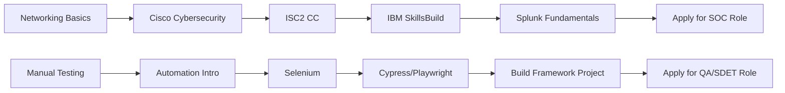

<!-- ================================================= -->
<!-- =============== CYBERPUNK HEADER =============== -->
<!-- ================================================= -->

<p align="center">
  
</p>

<p align="center">
  
</p>

<p align="center">
  
  
  
  
</p>

---

# 🧠 THE FREE CERTIFICATION ARSENAL

> A curated, verified, zero-cost certification roadmap for:
> - 🔐 SOC Analysts  
> - 🛡️ Cybersecurity Engineers  
> - 🤖 Automation Test Engineers  
> - 🚀 SDET Aspirants  

---

# 🔐 CYBERSECURITY CERTIFICATIONS

## 🥇 ISC2 – Certified in Cybersecurity (CC)
🌐 https://www.isc2.org/Certifications/CC  
✔ Entry-Level Global Certification  
✔ Vendor-Neutral  
✔ Recognized Worldwide  

---

## 🌐 Cisco Networking Academy
- Introduction to Cybersecurity  
- Cybersecurity Essentials  

🔗 https://www.netacad.com  

✔ Digital Badges  
✔ Strong Networking Foundation  

---

## 🧩 IBM SkillsBuild – Cybersecurity Analyst
🔗 https://skillsbuild.org  

✔ SOC Fundamentals  
✔ Threat Intelligence  
✔ Beginner Friendly  

---

## 📊 Splunk Fundamentals 1
🔗 https://www.splunk.com/en_us/training/free-courses/splunk-fundamentals-1.html  

✔ SIEM Basics  
✔ Log Monitoring  
✔ SOC-Oriented  

---

## 🧪 TryHackMe
🔗 https://tryhackme.com  

✔ Hands-on Labs  
✔ Red & Blue Team Exposure  

---

# 🤖 AUTOMATION TESTING CERTIFICATIONS

## 🧪 Selenium Basics – Great Learning
🔗 https://www.mygreatlearning.com/academy/learn-for-free/courses/selenium-basics  

✔ WebDriver  
✔ Automation Fundamentals  

---

## ⚡ Cypress / Playwright – TestMu
🔗 https://www.testmu.ai  

✔ Modern Automation Tools  
✔ Free Certificates  

---

## 🧱 Automation Testing Intro
🔗 https://www.mygreatlearning.com/academy/learn-for-free/courses/introduction-to-automation-testing  

✔ QA Fundamentals  
✔ Automation Lifecycle  

---

# 📊 CYBER ROADMAP



---

# ⚡ SKILL PROGRESSION MATRIX

Cybersecurity:
██████████░░ 80%

Automation:
████████░░░░ 65%

---

# 🏆 RECRUITER VISIBILITY BOOST

Add these to your resume:

✔ ISC2 CC  
✔ Cisco Cybersecurity Badge  
✔ Splunk Fundamentals  
✔ Selenium Automation  

Mention tools:
- SIEM
- Linux
- Selenium WebDriver
- Cypress
- Playwright
- Git
- CI/CD Basics

---

# 📈 GITHUB STATS

<p align="center">
  
  
</p>

---

# 📂 ADVANCED REPOSITORY STRUCTURE

```
cyber-automation-arsenal/
│
├── README.md
├── assets/
│   ├── cyber-banner.png
│   ├── roadmap.png
│
├── cybersecurity/
│   ├── isc2-cc-notes.md
│   ├── splunk-notes.md
│   ├── tryhackme-walkthroughs.md
│
├── automation-testing/
│   ├── selenium-guide.md
│   ├── cypress-guide.md
│   ├── playwright-guide.md
│
├── resume-boost/
│   ├── cybersecurity-resume-tips.md
│   ├── qa-resume-tips.md
│
└── projects/
    ├── mini-siem-project/
    ├── selenium-framework/
```

---

# 🌌 FINAL NOTE

This repository is built to:

⚡ Impress recruiters  
⚡ Showcase structured learning  
⚡ Demonstrate discipline  
⚡ Prove practical intent  

If this helped you — ⭐ the repository.

---

<p align="center">
  
</p>
